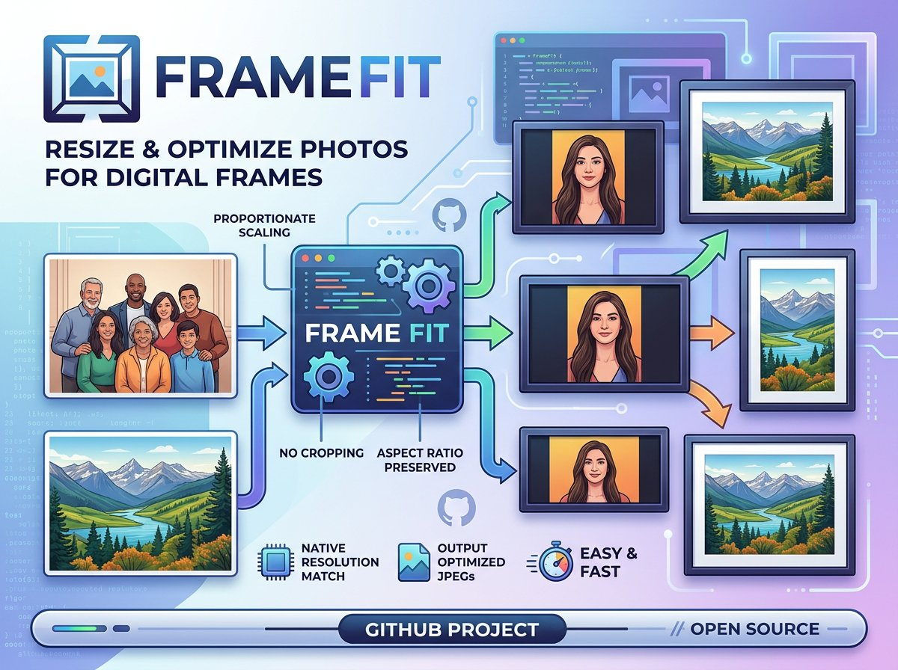

# FrameFit



Digital photo frames are low powered devices. If you do not need to zoom into
photos on the frame, it makes sense to prepare them to fit the photo frame's
resolution. This way, the photo frame can display them more efficiently without
needing to resize on the fly.

FrameFit is a simple Windows-friendly tool that prepares and optimises your
photos for a digital photo frame (such as those made by Aura, Lexar/Pexar,
PhotoSpring, and others). It scans a folder (and all subfolders), converts
supported image types to JPEG, and resizes each photo to fit your frame
resolution while keeping the original proportions (no stretching or squashing).

## Quick Start

Choose one path:

- Use binaries if you want the fastest setup and do not want to install Python.
  Download from [GitHub Releases](../../releases), then run the binary from a
  terminal.
- Use Python (3.10+) if you want to run from source, modify the code, or
  contribute. Set up a virtual environment and run `framefit.py`.

## What This Program Does

- Recursively scans a folder of photos (including subfolders)
- Supports common image formats such as JPG, JPEG, PNG, GIF, TIFF, BMP, and WEBP
- Converts each image to a standard (non-progressive) JPEG
- Resizes images proportionally to fit within your target resolution. Note that
  this means some photos may be smaller (narrower or shorter) than the photo
  frame's resolution, but they will not be stretched or distorted.
- Preserves EXIF metadata when available (for example: date taken)
- Deletes the original file after successful conversion

## Important

- This tool changes files in-place AND IS THEREFORE DESTRUCTIVE. Ensure you do
  not run this tool against your originals.
- Converted output is saved next to the original as a `.jpg` file, or overwrites
  existing JPEGs that require conversion.
- Original (non-JPEG) files are removed after successful conversion.
- Use `--dry-run` first to preview changes safely.

## Installation

### Binaries

You can download binary files from the [GitHub Releases](../../releases) page.
These are ready-to-run executables for Windows, macOS, and Linux. No
installation or Python setup is required. Just download the binary for your
platform and run it directly at a command line.

Example binary names:

- `framefit-windows-x64.exe`
- `framefit-macos-x64`
- `framefit-linux-x64`

### Python - Windows

You will need Python installed. Open PowerShell in this folder (`framefit`) and
run:

```powershell
Unblock-File -Path .\framefit.py
python -m venv venv
.\venv\Scripts\activate
pip install -r requirements.txt
```

### Python - macOS/Linux

Open a terminal in this folder (`framefit`) and run:

```bash
python3 -m venv venv
source venv/bin/activate
pip install -r requirements.txt
```

## Basic Usage

### Command Line (Binary, no Python)

After downloading the binary from [GitHub Releases](../../releases):

Windows (PowerShell):

```powershell
.\framefit-windows-x64.exe "C:\Path\To\Your\Photos"
```

macOS/Linux (Terminal):

```bash
./framefit-macos-x64 "/path/to/your/photos"
# or
./framefit-linux-x64 "/path/to/your/photos"
```

If needed on macOS/Linux, first make the binary executable:

```bash
chmod +x ./framefit-macos-x64
# or
chmod +x ./framefit-linux-x64
```

### Command Line (Python)

Having activated the virtual environment:

Windows (PowerShell):

```powershell
python framefit.py "C:\Path\To\Your\Photos"
```

macOS/Linux (Terminal):

```bash
python3 framefit.py "/path/to/your/photos"
```

Default target resolution is:

- Width: `2000`
- Height: `1200`

## Preview Mode (Recommended First)

Use dry run mode to see what would happen without creating or deleting files:

Binary:

```powershell
.\framefit-windows-x64.exe "C:\Path\To\Your\Photos" --dry-run
```

Python:

```powershell
python framefit.py "C:\Path\To\Your\Photos" --dry-run
```

## Custom Resolution

Example for 1920x1080:

Binary:

```powershell
.\framefit-windows-x64.exe "C:\Path\To\Your\Photos" --width 1920 --height 1080
```

Python:

```powershell
python framefit.py "C:\Path\To\Your\Photos" --width 1920 --height 1080
```

## Command Options

```text
path              Root folder containing your photos (required)
--width PIXELS    Target width (default: 2000)
--height PIXELS   Target height (default: 1200)
--dry-run         Preview only (no writes, no deletes)
```

## Supported Input File Types

Case-insensitive extensions:

- `.jpg`
- `.jpeg`
- `.png`
- `.gif`
- `.tiff`
- `.tif`
- `.bmp`
- `.webp`

## Troubleshooting

- If `python` is not recognized, install Python from python.org and enable "Add
  Python to PATH".
- If activation fails due to policy, run PowerShell as Administrator once and
  set:

```powershell
Set-ExecutionPolicy -Scope CurrentUser RemoteSigned
```

- If a file is corrupted or unreadable, the tool logs an error and continues
  with the next file.

## Contributing

Tests run automatically on GitHub Actions on every push to `main` and on every
pull request. See [docs/Testing.md](docs/Testing.md) for how to run tests
locally.
